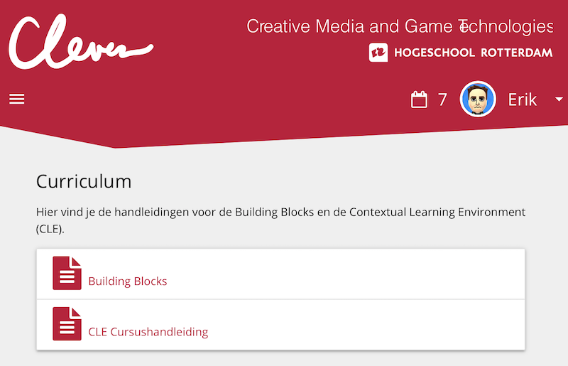
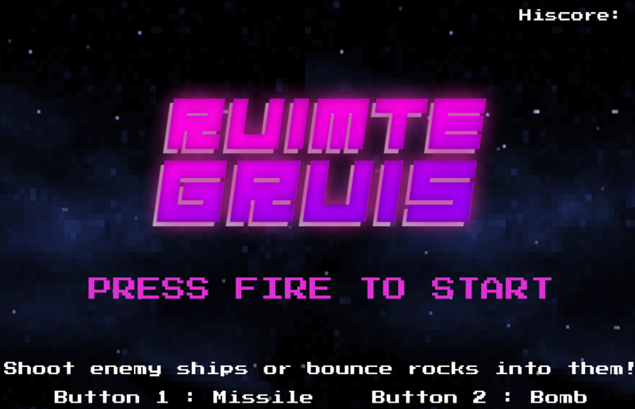
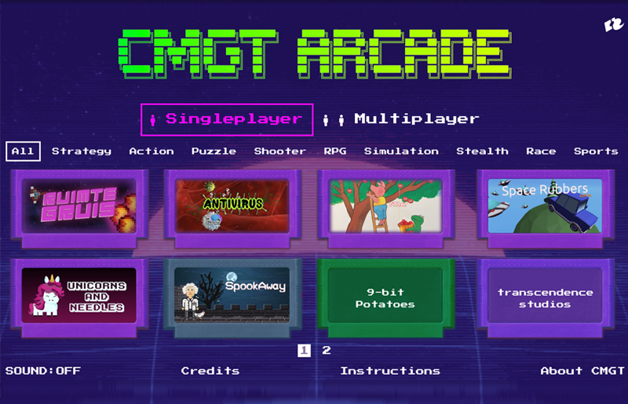
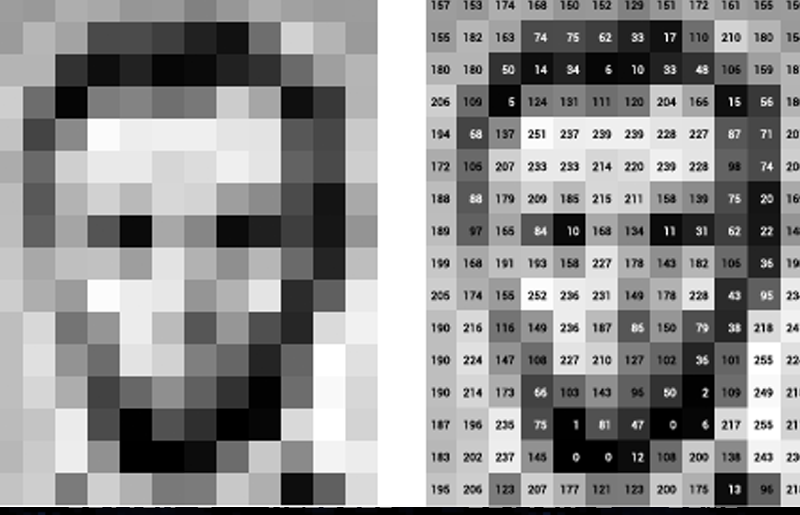
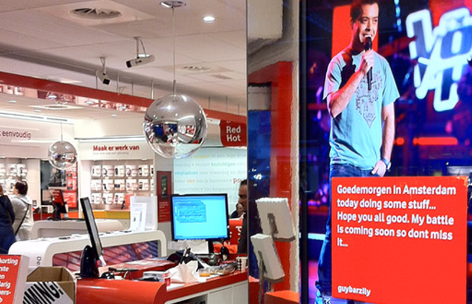
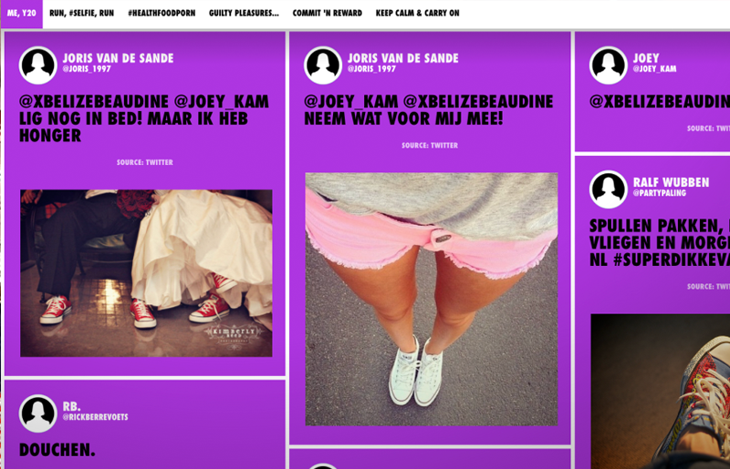
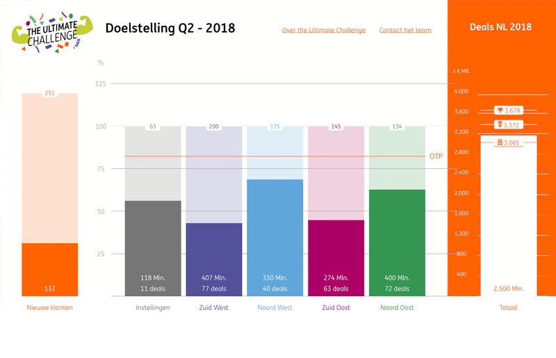

# Erik Katerborg

## Creative Technologist | Lecturer 

[Creative Media and Game Technologies | Rotterdam University for Applied Sciences](https://www.hogeschoolrotterdam.nl/opleidingen/bachelor/creative-media-and-game-technologies/voltijd/)

I organise workshops about Games, React, and Machine Learning for the web with Javascript and Typescript.

## Lecture subjects
 
 - Introduction to Machine Learning
 - Getting to know Web Components
 - Learning OOP with Typescript
 - Learning React and Vue
 - Building web games with Typescript and Phaser
 - Internet of Things devices with Arduino and Javascript

## University Projects

|  |  |
:-------------------------:|:-------------------------:
  |  
Clever - Student progress system | Student Portfolio website
  |  
Robot Royale - Online Multiplayer programmming game | Phaser Local Multiplayer Game - Typescript
  |  
Online Arcade Cabinet for student games | Machine Learning Algorithms Workshop

## Freelance Projects

|  |  |
:-------------------------:|:-------------------------:
  |  
Interactive Video Booth - Exposition University of Groningen | Build-a-Chip iPad Game
  |  
Heineken Twitter Visualisation | Vodafone - The Voice of Holland Store Visual
  |  
Nike Instagram - Live data visualisation | ING Sustainability - Interactive Visualisation
  |  
Pixel City Generator | Emoji Art Generator

## Repositories
 
- [Machine Learning reading list](https://github.com/KokoDoko/creative-coding)
- [Creative Coding reading list](https://github.com/KokoDoko/creative-coding)
- [Level editor built in Typescript](https://kokodoko.github.io/level-editor/)
- Building a [super-tiny sampler and drum computer](https://www.youtube.com/watch?v=bWudBkCdCZA) with Raspberry Pi
- [Pac man lamp](https://github.com/KokoDoko/PacmanLamp)
 
## Contact

[CMGT Rotterdam](https://www.hogeschoolrotterdam.nl/opleidingen/bachelor/creative-media-and-game-technologies/voltijd/) | [Github](https://github.com/KokoDoko) | [LinkedIn](https://www.linkedin.com/in/eerkmans/) | [Twitter](https://twitter.com/eerk) | [StackOverflow](https://stackoverflow.com/users/1083572/kokodoko)