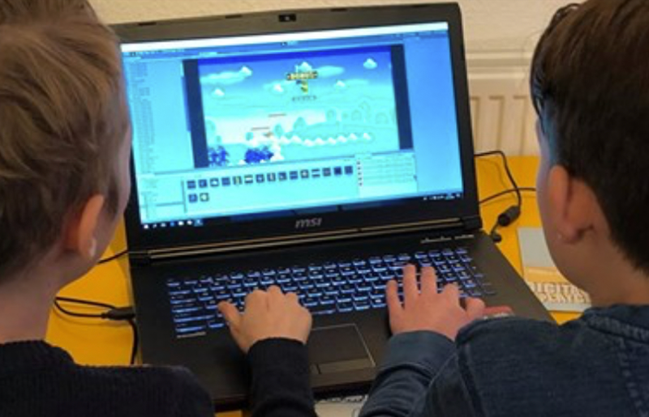

# Erik Katerborg

## Creative Technologist | Lecturer 

Hi! I'm Erik, I organise workshops and lectures about creative technologies! I'm currently interested in Machine Learning for the web, and creative coding in Javascript. I maintain a [Machine Learning reading list here](https://github.com/HR-CMGT/Machine-Learning-Readinglist). 

*Some keywords: Tensorflow, React, Typescript, Javascript, ML5, P5, TouchDesigner, Python, Arduino, Internet of Things.*

I work at [Creative Media and Game Technologies - Rotterdam University for Applied Sciences](https://www.hogeschoolrotterdam.nl/opleidingen/bachelor/creative-media-and-game-technologies/voltijd/) in Rotterdam, and I also organise private workshops for anyone who's interested. Recent workshops include the [introduction to ML5](https://medium.com/aixdesign/getting-started-with-ml5-js-tutorial-part-i-image-classifier-6d437ec38045) for [AIxDesign](https://www.aixdesign.co), and game design workshops for [Digital Playground](https://digitalplayground.nl). 

Formerly I worked for several creative agencies in the Netherlands, creating campaign work for big brand names. 

Read more about my [University projects](#uni), [Freelance projects](#freelance) and [Code experiments](#exp).

 
 

## University Projects

|  |  |
:-------------------------:|:-------------------------:
  |  
Clever - Student progress system | Student Portfolio website
  |  
Robot Royale - Online Multiplayer programmming game | CMGT Curriculum Graphic Design
  |  
Robot Building Workshop - Internet of Things | Machine Learning Algorithms Workshop 
  |  
Online Arcade Cabinet for student games | Phaser Local Multiplayer Game - Typescript

 
 

## Freelance Projects

|  |  |
:-------------------------:|:-------------------------:
  |  
Interactive Video Booth - Exposition University of Groningen | Build-a-Chip iPad Game
  |  
Heineken Twitter Visualisation | Vodafone - The Voice of Holland Store Visual
  |  
Nike Instagram - Live data visualisation | ING Sustainability - Interactive Visualisation
  |  
Digital Playground - Unity Workshop | Digital Playground - Unity Workshop

 
 

## Code Experiments

 |  |  |
:-------------------------:|:-------------------------:
   |  
Pixel City Generator | Emoji Art Generator

- [Pokémon browser built in React](https://kokodoko.github.io/react-pokedex/)
- [Level editor built in Typescript](https://kokodoko.github.io/level-editor/)
- [Raspberry Pi Sampler and Drum Computer](https://www.youtube.com/watch?v=bWudBkCdCZA) 
- [Pac man lamp](https://github.com/KokoDoko/PacmanLamp)
 
## More crazy stuff

[Github](https://github.com/KokoDoko) | [CodePen](https://codepen.io/eerk) | [Glitch](https://glitch.com/@KokoDoko)

## Contact

[CMGT Rotterdam](https://www.hogeschoolrotterdam.nl/opleidingen/bachelor/creative-media-and-game-technologies/voltijd/) | [LinkedIn](https://www.linkedin.com/in/eerkmans/) | [StackOverflow](https://stackoverflow.com/users/1083572/kokodoko)
