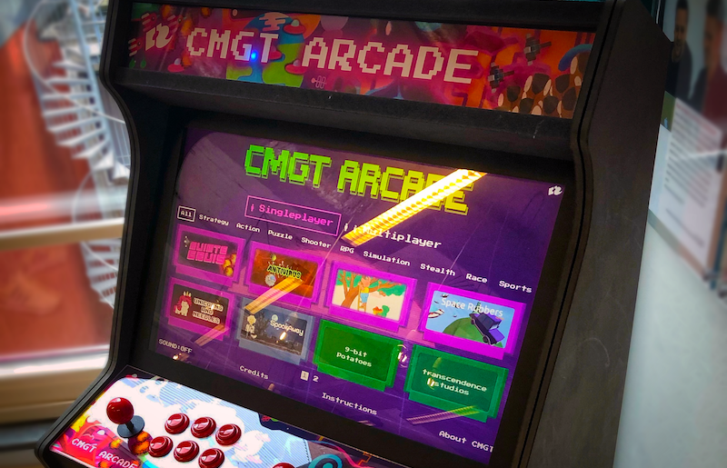
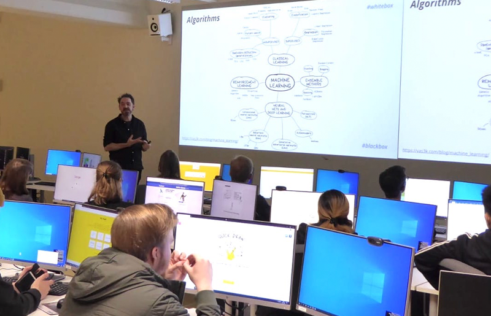
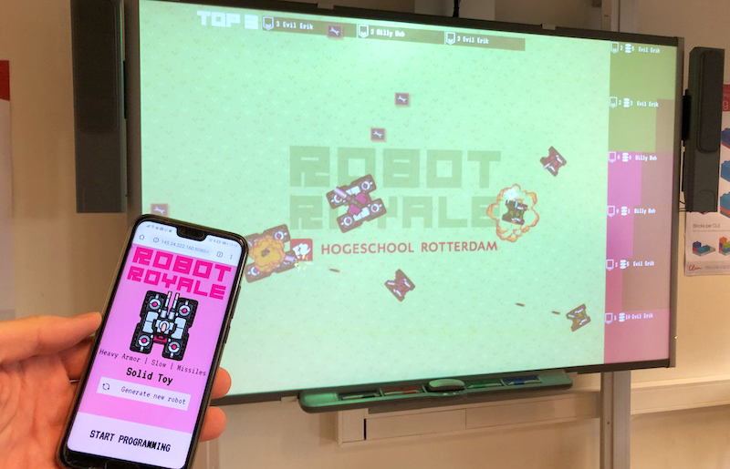
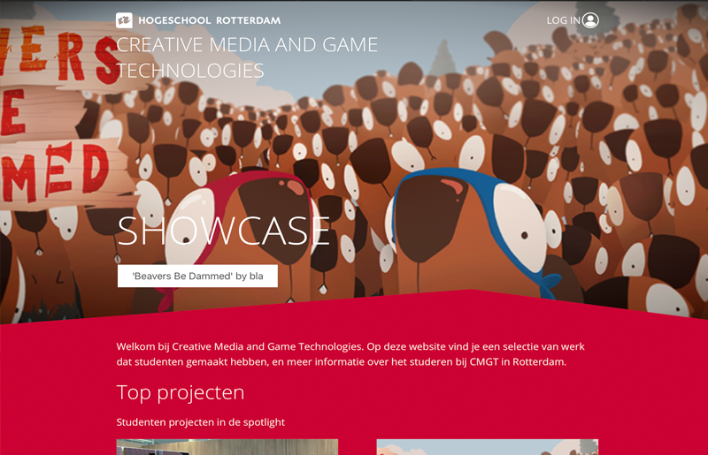
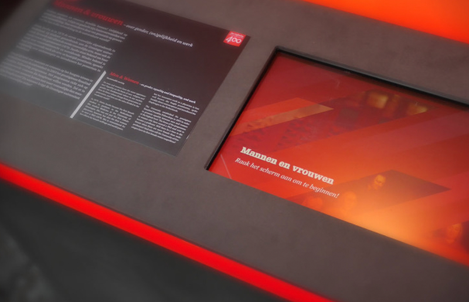
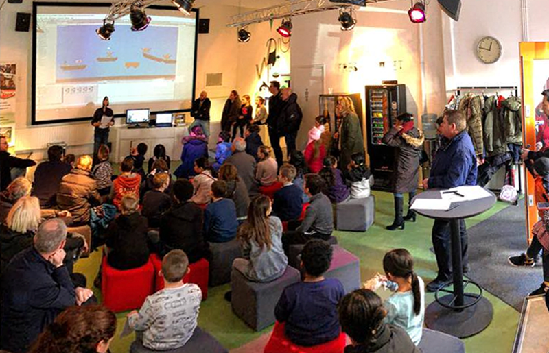
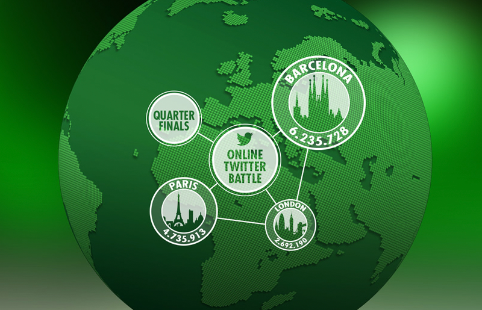
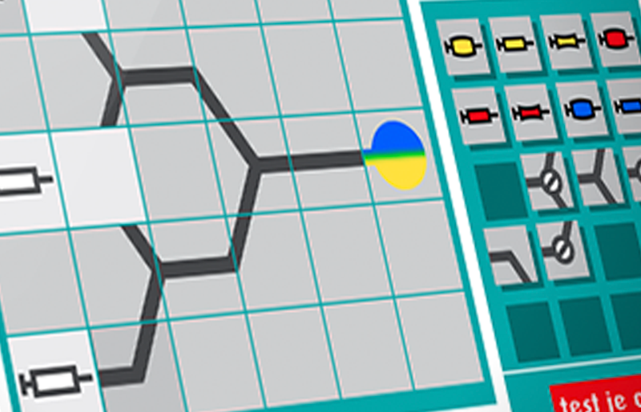
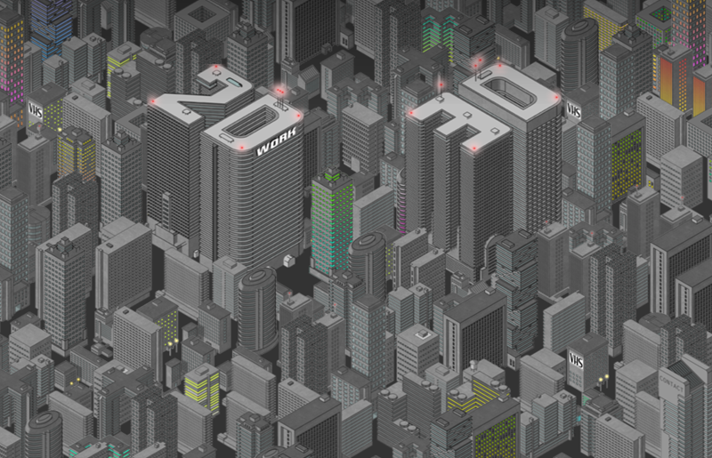
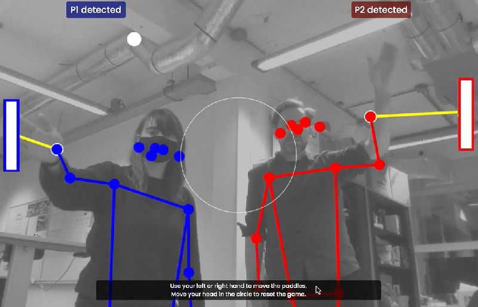

# Erik Katerborg | Creative Technologist | Lecturer 

Hi! I'm Erik, I organise workshops and lectures about creative technologies! I'm currently interested in Machine Learning for the web, and creative coding in Javascript. I maintain a [Machine Learning reading list here](https://github.com/HR-CMGT/Machine-Learning-Readinglist). 

*Some keywords: Tensorflow, React, Typescript, Javascript, ML5, P5, TouchDesigner, Python, Arduino, Internet of Things.*

I work at [Creative Media and Game Technologies - Rotterdam University for Applied Sciences](https://www.hogeschoolrotterdam.nl/opleidingen/bachelor/creative-media-and-game-technologies/voltijd/) in Rotterdam, and I also organise private workshops for anyone who's interested. Recent workshops include the [introduction to ML5](https://medium.com/aixdesign/getting-started-with-ml5-js-tutorial-part-i-image-classifier-6d437ec38045) for [AIxDesign](https://www.aixdesign.co), and game design workshops for [Digital Playground](https://digitalplayground.nl). 

Formerly I worked for several creative agencies in the Netherlands, creating interactive campaign work for brands such as Heineken, KPN, 3FM, Nike, ING, Vodafone. 

Read more about my [University projects](#uni), [Freelance projects](#freelance) and [Code experiments](#exp).

 
 

## University Projects

|  |  |
:-------------------------:|:-------------------------:
  |  
Online Arcade Cabinet for student games | Guest Lecture AI at [LAB Finland](https://www.lab.fi/en) 
  |  
Robot Royale - Online Multiplayer programmming game | Student Portfolio website

 
 

## Freelance Projects

|  |  |
:-------------------------:|:-------------------------:
  |  
Interactive Video Booth - Exposition University of Groningen | Digital Playground - Unity Workshop for kids
  |  
Heineken Twitter Visualisation | Build-a-Chip iPad Game

 
 

## Code Experiments

 |  |  |  |
:-------------------------:|:-------------------------:|:-------------------------:
   |    |  
Pixel City Generator | Emoji Art Generator | [Body Pose Pong](https://www.youtube.com/watch?v=DMebdxAp0j0)

Or check out the [Pokémon browser built in React](https://kokodoko.github.io/react-pokedex/), [Level editor built in Typescript](https://kokodoko.github.io/level-editor/), [Raspberry Pi Sampler and Drum Computer](https://www.youtube.com/watch?v=bWudBkCdCZA) or [Pac man lamp](https://github.com/KokoDoko/PacmanLamp)
 
 
 

## Contact

[CMGT Rotterdam](https://www.hogeschoolrotterdam.nl/opleidingen/bachelor/creative-media-and-game-technologies/voltijd/) | [LinkedIn](https://www.linkedin.com/in/eerkmans/) | [Github](https://github.com/KokoDoko) | [CodePen](https://codepen.io/eerk) | [Glitch](https://glitch.com/@KokoDoko)
