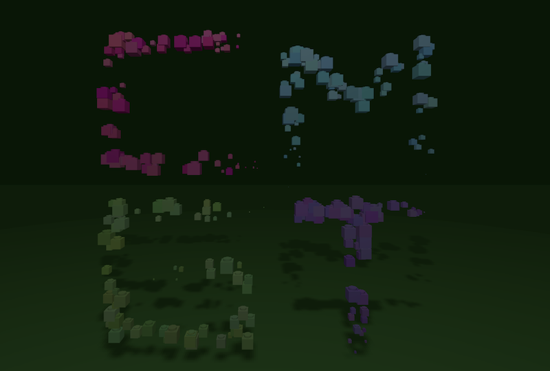
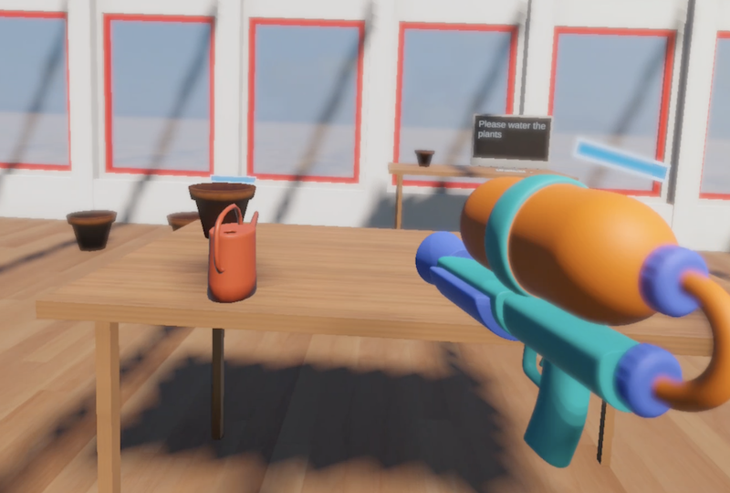
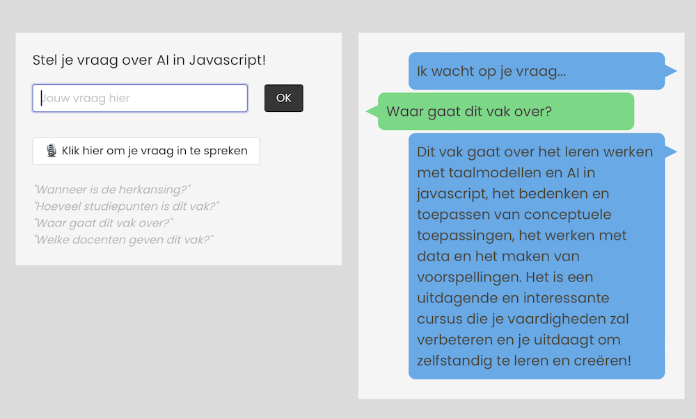
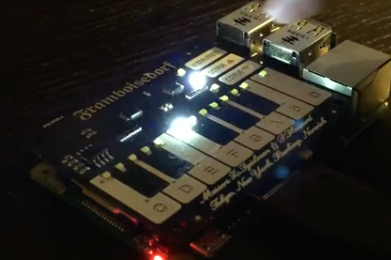

# Erik Katerborg | Creative Technologist | Lecturer 

Hi! I'm Erik, I teach at [Creative Media and Game Technologies - Rotterdam University for Applied Sciences](https://www.hogeschoolrotterdam.nl/opleidingen/bachelor/creative-media-and-game-technologies/voltijd/) in Rotterdam. I organise lectures and workshops in the field of creative coding. 

- Guest lectures about creative AI at [LAB Finland](https://lab.fi/en)
- Introduction creative AI for [AIxDesign](https://medium.com/aixdesign/getting-started-with-ml5-js-tutorial-part-i-image-classifier-6d437ec38045)
- *AI in Javascript* lecture at CMGT conference Netherlands
- Getting started with Unity for [Digital Playground](https://digitalplayground.nl). 

 

My most recent experiment is a dive into ***vibe coding*** by creating a [visualisation of a language model](https://kokodoko.github.io/llm-3d/).

   

## Recent

| VR |  |
|--------------------|--------------------|
  |  
[Web XR Animated Logo](https://kokodoko.github.io/cmgt-logo-xr/) *open this link on your VR headset* | [Unity XR Interaction Toolkit](https://youtu.be/nBZeMjhvK_k) 

| AI  |  |  |
|------------|-------------|--------|
  |   |  
Custom Chat LLM to answer student questions | [PONG game controlled by body poses](https://www.youtube.com/watch?v=DMebdxAp0j0) | [Visualising a language model in 3D](https://kokodoko.github.io/llm-3d/)

 
 

## University Projects

|  |  |
|--------------------|--------------------|
  |  
[Online Arcade Cabinet for student games](https://hr-cmgt.github.io/arcade-server/) | Guest Lecture AI at [LAB Finland](https://www.lab.fi/en) 
  |  
Robot Royale - Online Multiplayer programmming game | [Student Portfolio website](https://cmgt.hr.nl)  Visual design and frontend development.

 
 

## Freelance Projects

|  |  |
|-----------------|----------------|
  |  
Interactive Video Booth - Exposition University of Groningen | Digital Playground - Unity Workshop for kids
  |  
Heineken Visualisation displayed in Wembley Stadium London | Build-a-Chip iPad game for University of Groningen

>*I have done interactive campaign work for brands such as Heineken, KPN, 3FM, Nike, ING, Vodafone, University of Groningen and more*.

 
 

## Creative Coding

|  |  |  |
|-----------|---------|-------------------|
   |    |  
[Generative Pixel City](https://github.com/KokoDoko/kokodoko.github.io/blob/master/images/citybig.png?raw=true) | [Emoji Art Generator](https://codesandbox.io/s/emoji-webcam-qt1ocz) | [Matching Game in JS](https://kokodoko.github.io/zoekdezelfde/)
   |    |  
[Interactive Blockchain Tutorial](https://kokodoko.github.io/blockchain) | [React Pokedex](https://kokodoko.github.io/react-pokedex/) | [Raspberry Pi Drum Computer](https://www.youtube.com/watch?v=DMebdxAp0j0)

- [play Pac Man on an IKEA lamp](https://github.com/KokoDoko/PacmanLamp)
- [Visualise how a single-cell brain learns](https://kokodoko.github.io/perceptron/)
- [Build your own Mario level](https://kokodoko.github.io/level-editor/)
 
 
 
 

## Keywords

*TensorflowJS, React, React-Native, ThreeJS, Typescript, Javascript, ML5, P5, TouchDesigner, ExcaliburJS, Unity, Python, Arduino, Internet of Things, BlockChain.*

 
 
 

## Contact

[CMGT Rotterdam](https://www.hogeschoolrotterdam.nl/opleidingen/bachelor/creative-media-and-game-technologies/voltijd/) | [LinkedIn](https://www.linkedin.com/in/eerkmans/) | [Github](https://github.com/KokoDoko) | [CodePen](https://codepen.io/eerk) | [Glitch](https://glitch.com/@KokoDoko)
