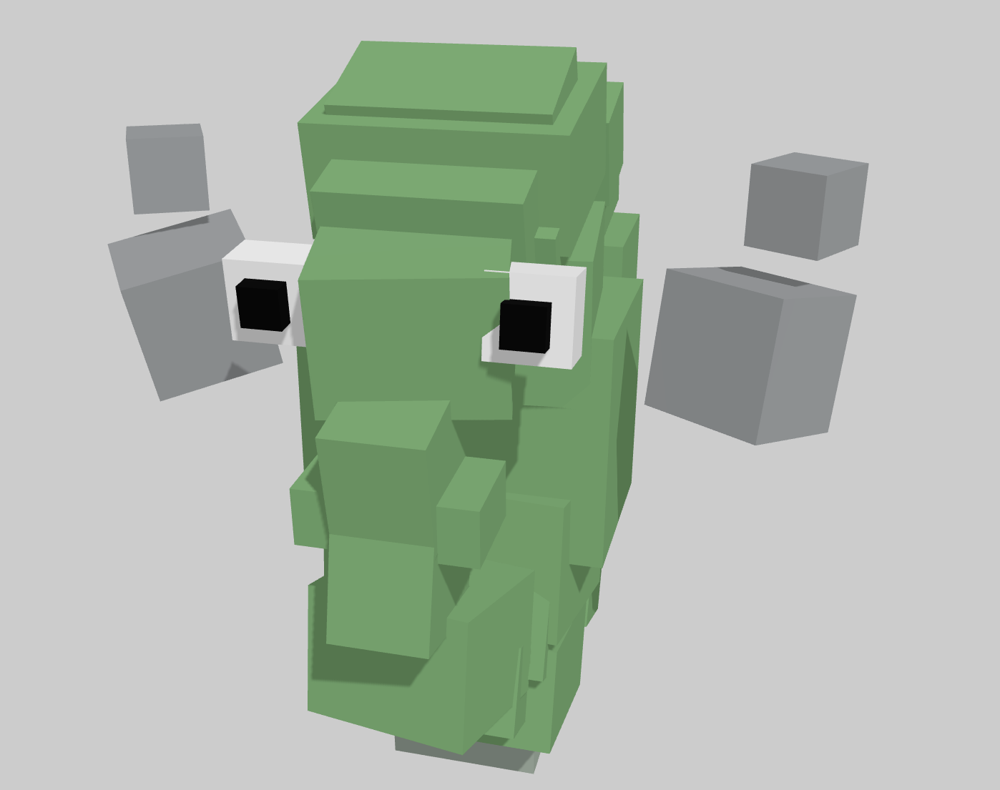
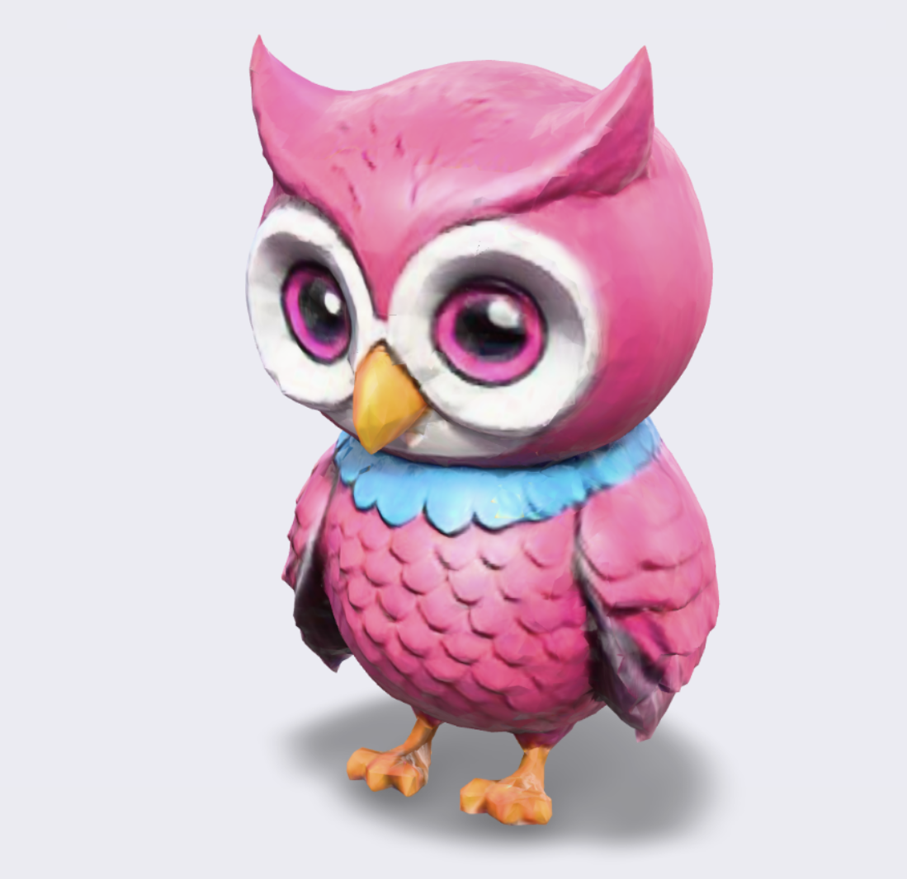
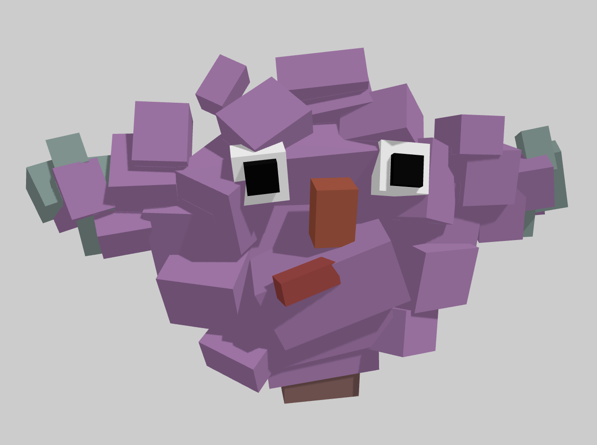
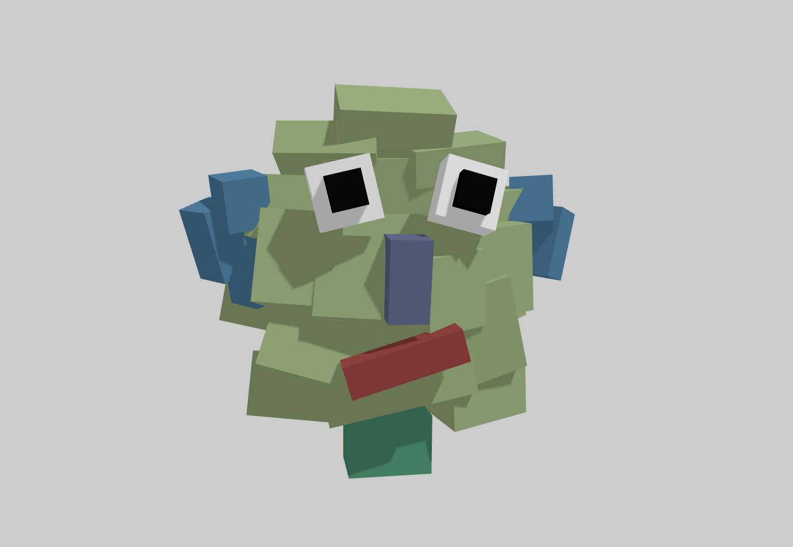
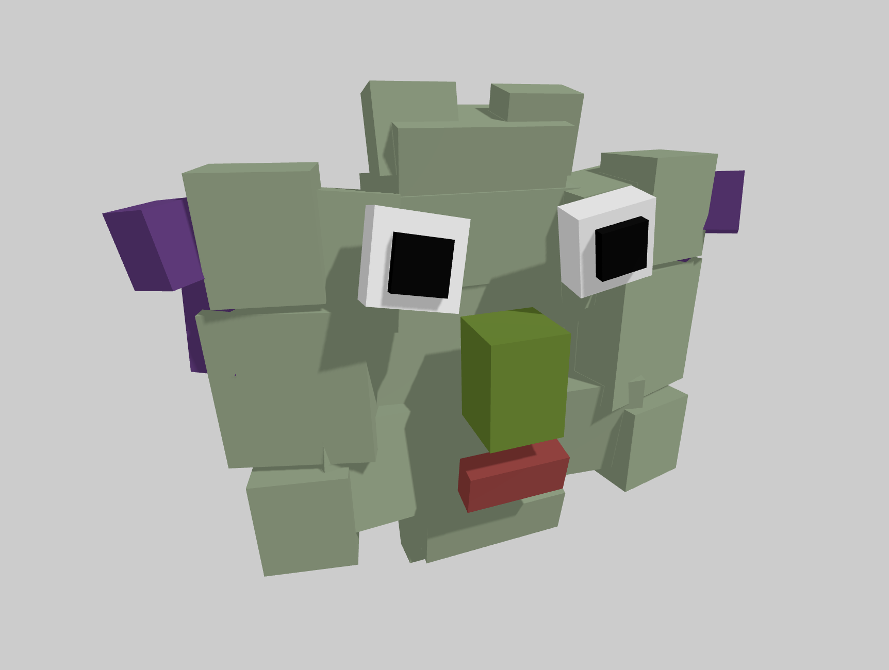
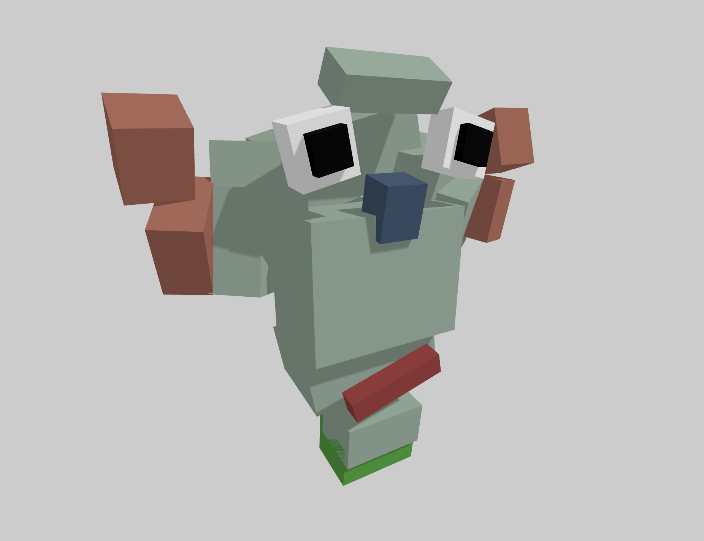
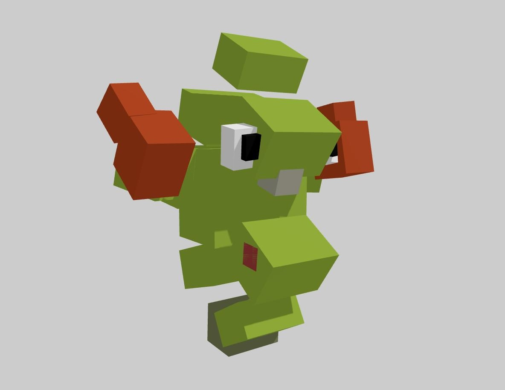
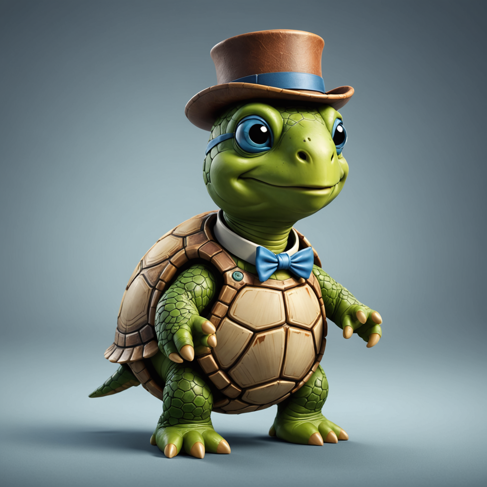
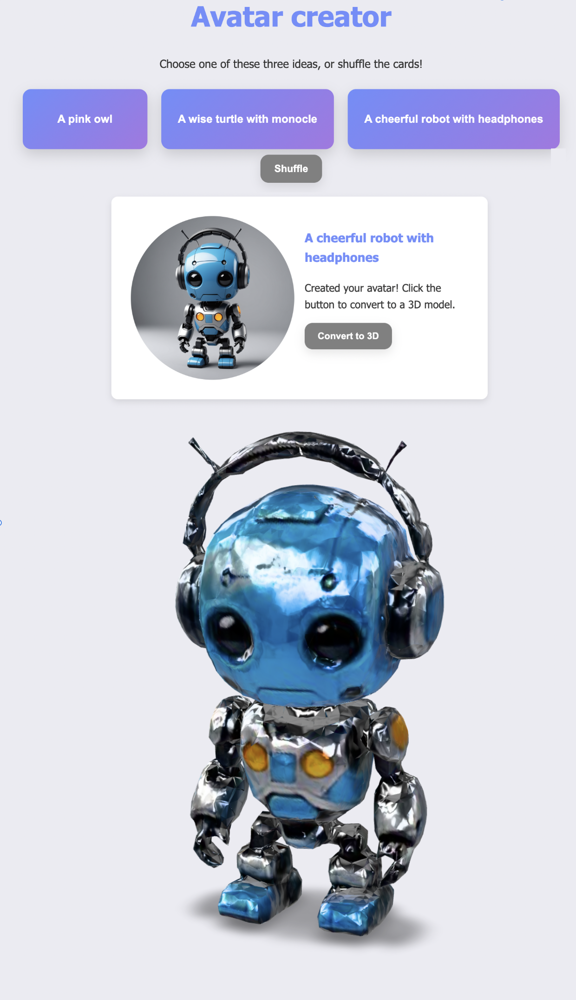

# Using AI to generate In-Game Avatars

In this post I want to share two experiments for generating 3D content with AI in a live running game or application:

|  |  |
|--------------------|----------------|
|   | [Using a language model to visualise a blocky world](#do-language-models-dream-of-blocky-monsters) |
|  | [Generating surprising 3D models in a web app](#using-ai-to-generate-in-game-avatars) |

<br><Br><br>

## Do language models dream of blocky monsters?

In this first experiment I wanted to find out if a language model *(chatGPT 4o and chatGPT3.5)* has a visual imagination. My prompts to the model are like this:

```
What would a cat look like if it was made out of 40 blocks? Tell me the size and location of those blocks in 3D space
```
Then, the results of the prompt are given to a traditional 3D engine, like Unity or in this case [ThreeJS](https://threejs.org). Some results:

| Blocky Avatars |  |  |
|--------------------|----------------|------------------|
|   |  |  |
|   |  |  |


<span style="font-size:1.2em;">[➡️ Create your own blocky monsters here](https://blocky-avatars.vercel.app/)</span>

<br><Br><br>

## Using an actual 3D model generator

Although using a LLM to create visuals is really fun, the results are highly erratic. 

The next step was to try out [StabilityAI](https://platform.stability.ai), this is a service that is good at generating 2D images *and* 3D models really fast. To generate a 3D model, you have to supply an image. This image can also be generated, and to make it more fun I use chatGPT to create ideas for the image:

| StabilityAI |  | 
|--------------------|----------------|
|   |  |
| 2D image based on idea from chatGPT | The generated 3D model (`.glb` file) | 

<br>

### Step 1

Prompting ChatGPT:

```
Give me three ideas for cool game avatars, keep the ideas short and sweet. Here are some examples: a cute cat wearing a baseball cap, a skeleton wearing sunglasses, a scruffy dog wearing a bandshirt
```
The ideas are shown as buttons.

### Step 2

Prompting StabilityAI for an image is done with the text from the button that the user clicked:

```
Create a simple image for a cheerful robot with headphones. Keep the image simple, without any background and not too much detail. It can look like a toy.
```

### Step 3

Here we send the image that was just generated *(and is stored on the server)* straight back to StabilityAI, to create a 3D model. This whole model gets sent back to the user as a `glb` file. In this demo I display the `glb` directly using [modelviewer](https://modelviewer.dev). 


<br><Br><br>


## Result




<br><Br><br>
