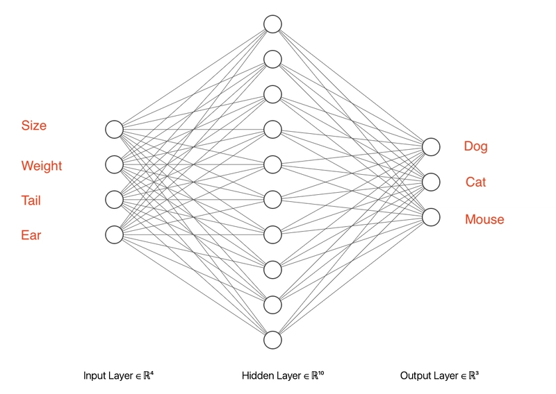

# TensorFlow

Tensorflow is a machine learning library that lets you create neural networks. This can bew used for classification, regression, image recognition, and other machine learning tasks. Essentially, a neural network can **recognise patterns in complex data**.

[TensorflowJS](https://www.tensorflow.org/js) uses javascript and can run in the browser or in node. In this tutorial I want to create a simple **classification network**, just to get to grips with the *terminology, pitfalls and basic workflow* of tensorflowJS.

<br><br><br>

## Neural Networks

A neural network is essentially an algorithm that uses weights and activation functions, which allow it to recognise patterns in the most complicated data. [Try it out here!](https://playground.tensorflow.org/)

<br><br><br>

## Goal

Today's goal is to create a **classification network** that can learn to recognise _dogs, cats and mice_ by looking at their features: _size, weight, tail length, and ear size_.

We start out with a demo dataset. We have 12 animals, each with  features and a label.

```js
const data = [
    [[18, 19, 5, 14], "dog"],    
    [[17, 18, 4, 13], "dog"],    
    [[19, 10, 6, 15], "dog"],    
    [[16, 17, 3, 14], "dog"],   
    [[3, 4, 8, 7], "cat"],       
    [[4, 3, 9, 6], "cat"],     
    [[3, 5, 7, 8], "cat"],       
    [[4, 4, 8, 7], "cat"], 
    [[0.5, 0.5, 2, 1], "mouse"],  
    [[0.3, 0.3, 1, 1], "mouse"], 
    [[0.7, 0.8, 3, 2], "mouse"], 
    [[0.6, 0.4, 2, 1], "mouse"]
];
```

The first thing to determine from this data is what shape the neural network should have. 

- There is always an _input layer_ which has a cell for each feature. In this case four cells. 
- There is always an _output layer_ which has a cell for each class that could possibly be predicted. Since we have 3 different animals this should have 3 cells.
- In between there are hidden layers. In this simple example we put one hidden layer with 10 cells.



  
<br><br><br>

## Project setup

In this example I set up a frontend Vite project with VanillaJS. The frontend will give us some nice visualisations.

```
npm create vite@latest
cd _your_project_name_
npm install @tensorflow/tfjs
npm install @tensorflow/tfjs-vis
```
From now on, we can use tensorflow in our JS files!
```js
import * as tf from '@tensorflow/tfjs';
import * as tfvis from '@tensorflow/tfjs-vis';
```

<br><br><br>

## Boilerplate

We can grab a code example for _classification_ from the [tensorflowjs website](https://www.tensorflow.org/js/tutorials).

The following code creates a neural network with the layer architecture as mentioned above. The comments attempt to explain what is happening:

```js
const classificationModel = tf.sequential();

// add the hidden layer of 10 units
// for the first hidden layer we also have to supply the input shape, which has 4 units
classificationModel.add(tf.layers.dense({ units: 10, inputShape: [4], activation: 'relu' }));

// the final layer has 3 output units (cat, dog, mouse)
classificationModel.add(tf.layers.dense({ units: 3, activation: 'softmax' })); 

// this line creates the model with settings that work well for classification
classificationModel.compile({
    loss: 'categoricalCrossentropy',
    optimizer: 'adam',
    metrics: ['accuracy']
});
```
The `relu activation` is a function that decides how important a cell is in the network. Different functions can be used here, but for `classification` the `relu` function is advised.

The `softmax activation` determines how the final result should be shown in the 3 output cells. In this case each cell will have a probability from 0 to 1. All three cells added up will always result in 1. For example, the output could be `[0.8, 0.1, 0.1]`

<br><br><br>

## Training

Training the model can be done with one line of code. We use 50 epochs to improve the model. In one epoch, the model attempts to improve itself to make better predictions. More epochs improve the accuracy. 

```js
await classificationModel.fit(trainingData, labels, { epochs: 50 });
```

⚠️ The `fit` function expects _separate trainingdata and labels_ though! That means we have to split our data into two arrays:

```js
const data = [[18, 19, 5, 14], [...], [...], ...etc]
const labels = ["dog", "dog", "dog", "dog", "cat", ...etc]
```

<br><br><br>

## Tensors

For the `fit` function to work, the data and label arrays need to be _tensorflow tensors_. This allows the calculations to run on the GPU of your machine. But this presents us with another problem: a tensor consists of numbers, but our labels are strings...

For classification tasks, the method for converting text labels into tensors that work for prediction is called _one-hot-encoding_. That means the labels become associated with one of the three output cells of the neural network.

If you look at the illustration above, we could say that:

- `dog`   is `[1,0,0]`
- `cat`   is `[0,1,0]`
- `mouse` is `[0,0,1]`

We will now convert all our data manually so you can see what's going on:

```js
const trainingData = tf.tensor2d([
    [8, 9, 5, 4],       // large dog
    [7, 8, 4, 3],       // medium dog
    [9, 10, 6, 5],      // big dog
    [6, 7, 3, 4],       // smaller dog
    [3, 4, 8, 7],       // cat
    [4, 3, 9, 6],       // cat
    [3, 5, 7, 8],       // cat
    [4, 4, 8, 7],       // cat
    [0.5, 0.5, 2, 1],   // mouse
    [0.3, 0.3, 1, 1],   // tiny mouse
    [0.7, 0.8, 3, 2],   // mouse
    [0.6, 0.4, 2, 1]    // mouse
]);

const labels = tf.tensor2d([
    [1, 0, 0],  // dog
    [1, 0, 0],  // dog
    [1, 0, 0],  // dog
    [1, 0, 0],  // dog
    [0, 1, 0],  // cat
    [0, 1, 0],  // cat
    [0, 1, 0],  // cat
    [0, 1, 0],  // cat
    [0, 0, 1],  // mouse
    [0, 0, 1],  // mouse
    [0, 0, 1],  // mouse
    [0, 0, 1]   // mouse
]);
```
Now our data should work with the `fit` function! Try it out!

<br><br><br>

## Predicting

Once your `fit` function finished running (this is an asynchronous process), you can start making predictions on your model. 

> *This means that we feed 4 numbers into 4 input cells of the network, and then we check what the values are of the 3 output cells of the network!*

```js
// Predict an animal with features 4,5,3,4 
const testData = tf.tensor2d([[4, 5, 3, 4]]); 
const prediction = classificationModel.predict(testData);

console.log('Prediction probabilities:');
prediction.print();
```
This will output a tensor that looks like this. These are the values of the last 3 cells in the neural network!
```js
[[0.2227311, 0.6748303, 0.1024387],]
```
Since we decided that the 3 output cells stand for `[dog, cat, mouse]`, you can read the prediction as follows:

- 22% chance of "dog"
- 67% chance of "cat"
- 10% chance of "mouse"

So the animal is most likely a _cat_ 🐈! Congratulations! You have now got the bare basics of TensorFlowJS working!

<br><br><br>

## Showing the actual label

It would be nicer to show the actual predicted label in the console. To do that, we first need to get the tensor data back from the GPU into a normal javascript variable. This is done using `tensor.dataSync()`.

```js
const predictedClass = prediction.argMax(1).dataSync()[0];
```
This gives the index of the higest value, so `0, 1` or `2`. We use the index to get the right label:

```js
const classNames = ['dog', 'cat', 'mouse'];
const className = classNames[predictedClass];
console.log(`I think it's a: ${className}`);
```

<br><br><br>

# Visualising training

In our current code we have no idea how many epochs we need, or if our one hidden layer is enough to run the `fit` function. We can visualise the training with the [Tensorflow Visor Library](https://js.tensorflow.org/api_vis/1.5.1/)

```js
await classificationModel.fit(trainingData, labels, {
    epochs: 250,
    callbacks: tfvis.show.fitCallbacks({ name: 'Training' }, ['loss'], {
        callbacks: ['onBatchEnd']
    })
});
tfvis.show.modelSummary({ name: 'Model' }, classificationModel);
```
This example shows the `loss` function during training. This number should converge towards 0.0 during training. It will never reach 0 though! Try to get it to reach between 0.2 and 0.4 for this exercise, by adjusting the amount of epochs.

<br><br><br>

# Memory leaks

Creating a tensor is done on the GPU, and they have to be disposed of manually when no longer needed. This can be done using `dispose` and `tf.tidy`. 

We also should organise our code a bit nicer in functions at least. The whole code now looks like this:

```js
let classificationModel

async function createModel() {
    // create a classification model
    classificationModel = tf.sequential();
    classificationModel.add(tf.layers.dense({ units: 10, inputShape: [4], activation: 'relu' }));
    classificationModel.add(tf.layers.dense({ units: 3, activation: 'softmax' }));
    classificationModel.compile({
        loss: 'categoricalCrossentropy',
        optimizer: 'adam',
        metrics: ['accuracy']
    });

    // train the model
    await classificationModel.fit(trainingData, labels, {
        epochs: 250,
        callbacks: tfvis.show.fitCallbacks({ name: 'Training' }, ['loss'], {
            callbacks: ['onBatchEnd']
        })
    });
    tfvis.show.modelSummary({ name: 'Model' }, classificationModel);

    // clear the training data tensors from memory
    trainingData.dispose();
    labels.dispose();
}

// predict an animal. use tf.tidy to remove the temporary tensors right away
function predict(animal) {
    return tf.tidy(() => {
        const testData = tf.tensor2d([animal]);
        const prediction = classificationModel.predict(testData);

        console.log('Prediction probabilities:');
        prediction.print();

        const predictedClass = prediction.argMax(1).dataSync()[0];
        const classNames = ['dog', 'cat', 'mouse'];
        return classNames[predictedClass];
    });
}

await createModel()

let result = predict([5, 6, 7, 6])
console.log(`I think it's a ${result}`);
```

🤩 That's it! The code is still pretty concise if you consider everything that's happening under the hood!

<br><br><br>

# Tutorial part 2

In the next tutorial we will look at some necessary improvements:

- We should create a function that converts the training labels automatically into the "one-hot-encoding" format
- Data should be normalized before training, otherwise the model will incorrectly assume that a feature with a bigger range is more important than a feature with lower range.
- We should create test data and an `evaluate` function to test if our model actually predicts well on unknown, but labeled, animal data.
- Adding more layers
- We should be able to save a model after training


